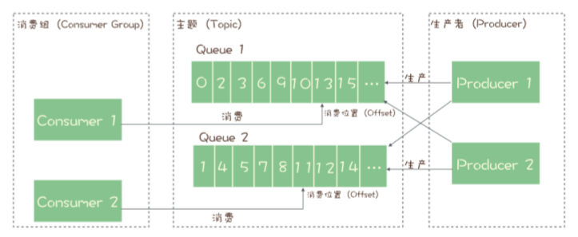
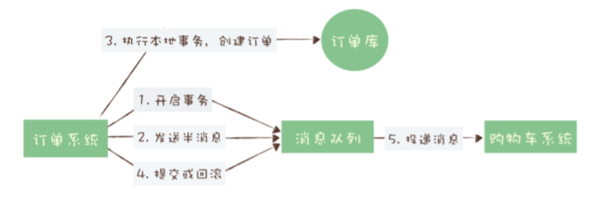
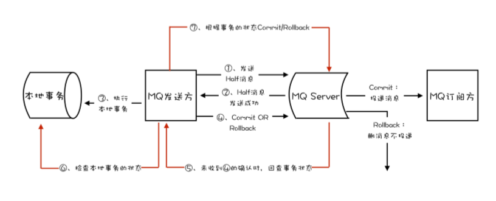

# 消息队列

## 资料汇总

- RocketMQ	官方文档：	https://rocketmq.apache.org/docs/quick-start/  
- RocketMQ	中国开发者中心：http://rocketmq.cloud/zh-cn/  
- Kafka	官方文档：	http://kafka.apache.org/documentation/  
- RabbitMQ	官方文档：	https://www.rabbitmq.com/documentation.html

## MQ的使用场景

### 秒杀系统

利用有限的资源，尽可能处理短时间内的海量请求

1. 异步处理

   本来的系统可能要处理风险控制、库存锁定、生成订单、短信通知、更新同数数据等功能。而MQ先把风险控制、库存锁定先完成了，返回客户秒杀结果。把请求放到MQ里，其他的步骤异步后续操作。

2. 流量控制

   - 方式1：MQ隔离网关和后端程序，可以保护后端服务。后端服务能处理多少数据就从网关中拿多少数据。
     - 增加调用链环节，响应时延长
     - 上下游改为异步消息，增加系统复杂度

   - 方式2：令牌桶流量控制，令牌桶按照预估的处理能力，匀速往令牌队列存放令牌（满了就丢弃），网关处理前先拿令牌，拿到令牌再做调用后端秒杀服务。

3. 服务解耦，方便开发

## MQ类别

### RabbitMQ

- 优点：开箱即用；轻量；支持多种语言；可自定义路由规则
- 缺点：消息堆积调职性能急剧下降；性能较低（十几万/s）；Erlang语言编写，语法复杂

###  RocketMQ

- 优点：响应快（几十万/s，适合在线业务场景）
- 缺点：兼容生态较差

### Kafka

- 优点：周边生态兼容好（适合配合开源产品）；响应快（几十万/s）；
- 缺点：收发响应时延高（攒一波一起处理），不适合在线业务场景

## 主题和队列

### 队列的演进

早期消息队列，采用的就是队列数据结构，为了让每个消费者可以重复消费信息，需要为每个消费者创建一个单独的队列。  

后来演化出了发布-订阅模型，主题用来存放发布者传来的信息，订阅者可以多次消费一份消息数据。

### RabbitMQ的消息模型

RabbitMQ使用的是：队列模型，它通过Exchange配置的策略来决定消息传到哪个队列中

### RocketMQ,Kafka的消息模型 

RocketMQ，Kafka使用的是：发布-订阅模型

RocketMQ的消费机制：生产者发送消息给服务端（Broker），服务端受到信息之后返回确认响应。生产者会重复发送，直到收到响应。服务端也同理，直到收到消费端的确认响应，才会停止发送消息。

但是这种机制为了确保消息有序性，只有在上一条数据被消费后，下一条数据才能被执行。

为了扩展消费者的消费能力，RocketMQ在主题下增加队列概念(Kafka中叫做分区)，通过队列实行并行消费。消费组之间互不影响，各自负责一部分消息。（若消费位置处理不当将导致丢消息）

  

## 消息队列实现分布式事务

事务具有四个属性ACID：原子性、一致性、隔离性、持久性

实现严格分布式事务时不可能完成的任务，用MQ实现分布式事务如下：

  

半消息的意思是改消息在未提交事务之前，对消费者是不可见的。如果创建订单失败，就回滚信息，购物车就不会受到这条消息。

但是最后的``提交或回滚``操作可能失败；一旦失败，Kafka将抛出异常（用户自行解决），而Rocket则采用事务反查机制来决定提交还是回滚。（例如查询订单是否存在）反查步骤如下：

  

waiting for 05

